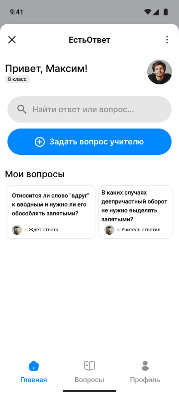
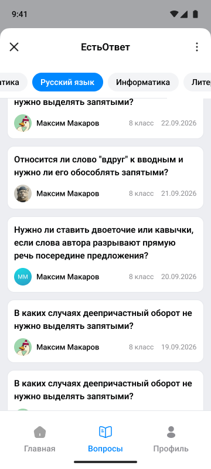
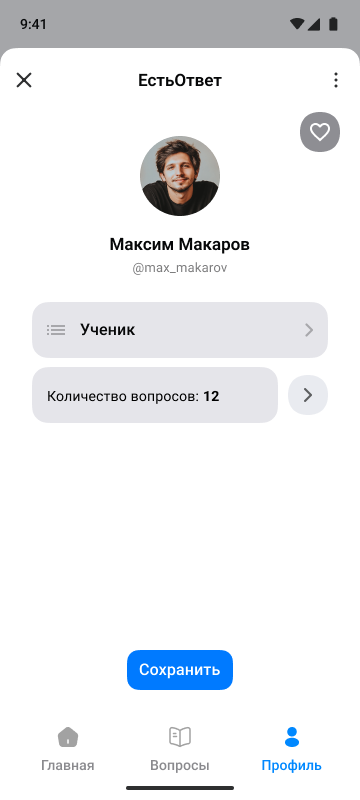
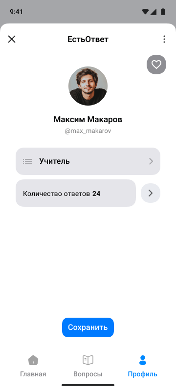

# Проект ЕстьОтвет

  
  
  
  

## Планы проекта
|План|Описание|Прогресс|
| --- | --- | --- |
|**Связать с MAX Bridge**|Библиотека MAX Bridge позволяет мини-приложениям корректно взаимодействовать с API MAX и API операционной системы на устройстве пользователя|`0%`|
|**Функционал вопросов**|Лайки, ответ, прикрепление медиа|`0%`|
|**Функционал профиля**|Статистика лайков, ответов, вопросов, избранное|`0%`|
|**Сдача проекта**|Dockerfile, requirements.txt|`0%`|

